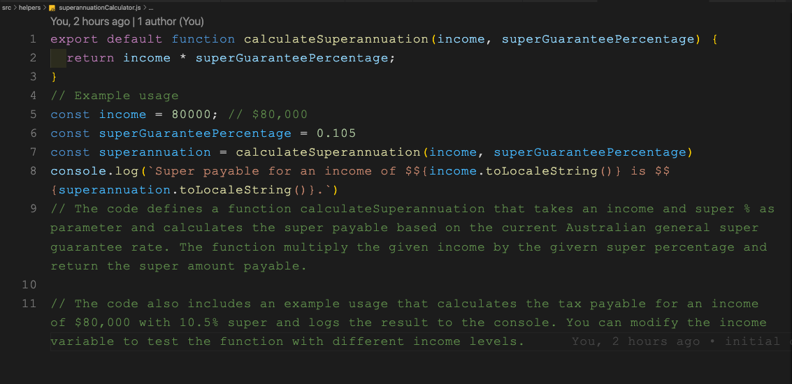

# Cloudcase Code Challenge

## Table of Contents: 

[Cloudcase Candidate Programming Exercise](#exercise)  
[Live solution - deployed at Netfly](#deployed)   
[Exercise solution - Onboarding](#solution)  
[Onboarding Flow](#flow)   
[Onboarding Form](#form)   
[Form data on submit](#data)   
[Onboarding tax calculation logic/algorithm](#tax-calculator)  
[Onboarding superannuation calculation logic/algorithm](#superannuation-calculator)  
[Tech Stack](#stack)  
[Guide - How to run the Onboarding Form](#guide)  
[To run the test for tax calculation feature](#tax-test)  
[To run the test for superannuation calculation feature](#super-test)  
[What the onboarding form does not include or did not care about: (!IMPORTANT)](#not-included)  
 
  

---  
  

## Cloudcase Candidate Programming Exercise    
 
Cloudcase (the company and the platform) is focussed on solving complex business problems for our clients.  
The programming exercise below is designed to allow candidates to show us how they go about solving a business problem.  
We are not trying to test you, and we do not encourage overthinking the solution.  

A bank would like to onboard a new staff member who has just been recruited.  
As part of this process, the bank would like to send the new staff member an electronic form to complete.  
This form needs to capture the information required to set up the staff member in their payroll and HR systems.  
However, their payroll system has a major limitation, it can’t calculate an individual’s annual tax nor their annual superannuation contributions.   
Therefore, the onboarding process needs calculate these numbers.   

Before the system is built the bank would like the following:
- A design for the new onboarding form,
- A simple program which can calculate the annual tax and superannuation for a given salary amount. 

As part of this exercise can you please create the following:
* A design of what information the new staff member onboarding form should contain. This can be completed as: written text, drawn on paper (and scanned) or built in HTML/Javascript. 
* Regarding the design above, please outline your reasons for the design choices you made.
* A program to calculate the annual tax and superannuation for a given salary (please see rate table below). This can be deployed using Java or Javascript.
* A few written or programmed tests to prove the tax and superannuation calculations  
  

 ---  
  
    
## Live solution - deployed at Netfly

Click on the link below to be redirected to the Onboarding Form webpage   

[Cloudcase Onboarding Form](https://cloudcaseonboarding.netlify.app/)

 ---  
  

## Exercise solution - Onboarding

In order to streamline this exercise, we will focus specifically on the onboarding process for an Australian organization, taking into account the country's unique requirements. To simplify matters, we will assume the most common scenario where the employee claims the tax-free threshold.

The necessary fields for an onboarding form in Australia may vary depending on the company's specific requirements, but generally, an onboarding form in Australia should include the following fields:

- Personal Information: Name, Address, Phone Number, Email, Date of Birth, Tax File Number (TFN)  

- Employment Information: Employment start date, Job Title, Salary, Work Schedule, Role(Supervisor/Manager/Employee)  

- Emergency Contact: Name, Relationship, Phone Number  

- Bank Details: Bank Name, BSB Number, Account Number  

- Superannuation: Superannuation Fund Name, Membership Number, Fund ABN  

- Employment Eligibility: Proof of work eligibility, Visa status  

- Workplace Health and Safety: Any workplace health and safety concerns or requirements  

- Policies and Procedures: Acknowledgment of company policies and procedures, including Code of Conduct, Workplace Health and Safety, Anti-Discrimination, etc.  

- Tax Declaration: Employee Tax File Number Declaration and Tax Withholding Form  

It is important to note that employers must ensure that they comply with privacy laws when collecting and handling employee information.   
Employers should only collect information that is necessary and relevant to the employment relationship and have processes in place to ensure that the information is kept confidential and secure.   
   

 ---  
  
    
## Onboarding Flow

  
  

 ---  
  
    
## Onboarding Form

 - Employment information does not require any input from the employee. Displaying these info at the onboarding form sent to the employee is optional and can could be omitted. However for the sake of this exercise I have decided to display it as read-only/disabled fields.

  
  

 ---  
  
    
## Form data on submit - (Modal created just to illustrate the data meant to be posted / integrated with Payroll and HR system - API) 

  
  

 ---  
  
    
## Onboarding tax calculation logic/algorithm  

The tax calculation logic can be found here [Github](https://github.com/Kryptic2020/Cloudbase-onboarding-challenge/blob/main/src/helpers/taxCalculator.js)  
    
  

 ---  
  
    
## Onboarding superannuation calculation logic/algorithm

The superannuation calculation logic can be found here [Github](https://github.com/Kryptic2020/Cloudbase-onboarding-challenge/blob/main/src/helpers/superannuationCalculator.js)  
  
  

 ---  
  
    
## Tech Stack  

 - Javascript - ReactJs library
 - Bootstrap - css stylesheet / Bootstrap components
 State managed locally with no persistent data  
   

 ---  
  
    
## Guide - How to run the Onboarding Form

1 - Clone the repo from [Github](https://github.com/Kryptic2020/Cloudbase-onboarding-challenge/blob/main/README.md)  
2 - In the project directory, install dependencies by running:  
`npm install`  
3 - To run the app in the development mode:  
`npm start`    
Open [http://localhost:3000](http://localhost:3000) to view it in your browser.  
  

 ---  
  
    

## To run the test for tax calculation feature   

In the project directory, you can execute the test suit by running  
`npm test taxCalculator.test.js` 

  

 ---  
  
    

## To run the test for superannuation calculation feature  
 
In the project directory, you can execute the test suit by running  
`npm test superannuationCalculator.test.js` 

  
  

 ---  
  
    

## What the onboarding form does not include or did not care about: (!IMPORTANT)

Is is assumed that this exercise does not focus on software development, the real target is on the business problem solving ability.
- The onboarding.jsx file is too long, affecting readability, hard to mantain.
- Each section of onboarding.jsx could be separate file, be an individual component by category ex. personal details, bank details, etc
- Input validations has not been implemented as it is out of this scope.
- Persistent data has not been implemented as it is out of this scope.
- UI/UX such as Datepicker, thousand separation, responsible layout has been ignored as it is out of this scope.
- Anything other than business logic approach has been ignored as it is out of this scope.